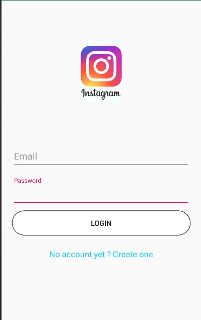
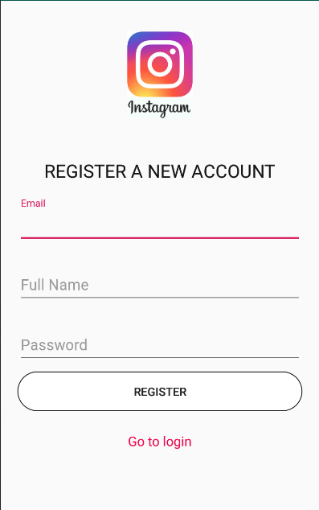
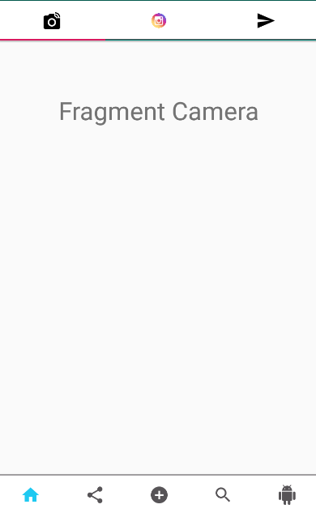
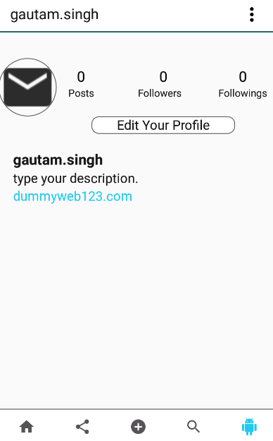
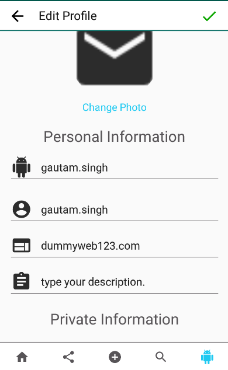
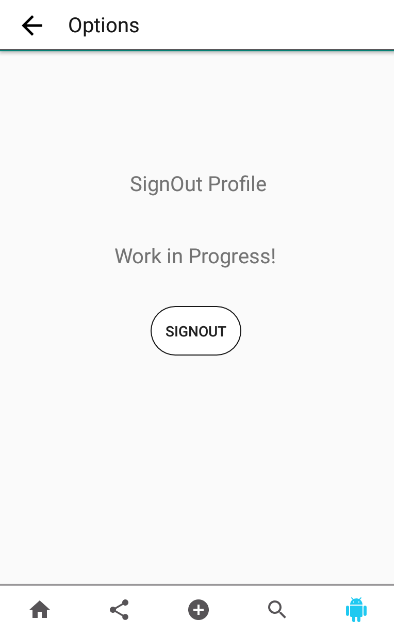

# InstagramClone
Ok friends here is my instagram clone app (*In Progress), I made it because, I wanna practice my skills on android and firebase and do you know it's growing injoy :) 

# ScreenShots and Explanation
So, below you can see the screnn shots representation of the application itself, it's quite easy to understand, these steps as we already used in intagram application.

# Shot 1
This is the login activity, it's needs your signed gmail id and password which is saved on the firebase server.

# Shot 2
This activity is used to register you to the application with the "Email Verification".

# Shot 3
Here, we have the home page page of the application with three TabLayout.

# Shot 4
It's a profile activity where user can see his info and the person he follows and followers of him and his photots he uploaded.

# Shot 5
Here, the user can change the user details like (name, email, phone no, discription).

# Shot 6
This fragment will be used to signOut from the application.

